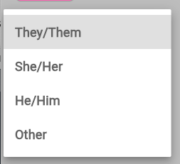
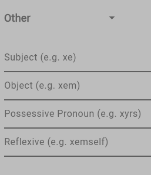

# How do do a pronoun form field correctly

Get the Flutter code [here](pronouns.dart).

Start with a dropdown list:


We'll have the three most common pronoun sets available for easy selection:



The "other" option is where the magic happens, we offer space to enter all the components of a pronoun set:



But that's not the best part, when the user enters the subject, we fill in the rest of the fields. Surprise and delight, right? We have a set of common neopronouns and we use some basic logic to predict what the remaining items in the set will be:

```dart
void _fillPronouns(String subject) {
  Pronouns pronounSet;
  final String lowerSubject = subject.toLowerCase();
  if (neopronouns.containsKey(lowerSubject)) {
    pronounSet = neopronouns[lowerSubject]!;
  } else {
    final reflexive = lowerSubject == '' ? '' : _generateReflexive(subject);
    pronounSet = Pronouns(
      subject: lowerSubject,
      object: subject == '' ? '' : _generateObject(subject),
      possessivePronoun:
          subject == '' ? '' : _generatePossessivePronoun(subject),
      reflexive: reflexive,
    );
  }

  _objectController.text = pronounSet.object;
  _otherPronouns.object = pronounSet.object;

  _possessivePronounController.text = pronounSet.possessivePronoun;
  _otherPronouns.possessivePronoun = pronounSet.possessivePronoun;

  _reflexiveController.text = pronounSet.reflexive;
  _otherPronouns.reflexive = pronounSet.reflexive;
}
```

The logic is pretty straightforward:
```dart
String _generateReflexive(String subject) {
  final lowerSubject = subject.toLowerCase();

  if (lowerSubject.endsWith('s')) {
    return '${lowerSubject}self';
  } else if (lowerSubject.length == 1 || lowerSubject.endsWith('i')) {
    return '${lowerSubject}erself';
  } else {
    return '${lowerSubject}self';
  }
}

String _generateObject(String subject) {
  final lowerSubject = subject.toLowerCase();

  if (lowerSubject.endsWith('e')) {
    // Vowel-ending subjects like "xe", "ze" often add "m" or "r" for object forms
    return '${lowerSubject}m';
  } else if (lowerSubject.endsWith('s') || lowerSubject.endsWith('r')) {
    // Subjects ending in "s" often remain unchanged
    return lowerSubject;
  } else {
    // Default to adding 'r' if it makes sense for smoothness
    return '${lowerSubject}r';
  }
}

String _generatePossessivePronoun(String subject) {
  final lowerSubject = subject.toLowerCase();

  if (lowerSubject.endsWith('e')) {
    // Vowel-ending subjects like "xe", "ze" typically add "r" + "s"
    return '${lowerSubject}rs';
  } else if (lowerSubject.endsWith('s')) {
    // Subjects ending in "s" can remain unchanged
    return lowerSubject;
  } else if (lowerSubject.length == 1 || lowerSubject.endsWith('i')) {
    // Short or single-syllable subjects add "r" + "s"
    return '${lowerSubject}rs';
  } else {
    // Default case for other subjects, adding 'r' + 's'
    return '${lowerSubject}s';
  }
}
```

and the array isn't that big:
```dart
final Map<String, Pronouns> neopronouns = {
  'xe': Pronouns(
    subject: 'xe',
    object: 'xem',
    possessivePronoun: 'xyrs',
    reflexive: 'xemself',
  ),
  'xy': Pronouns(
    subject: 'xy',
    object: 'xyr',
    possessivePronoun: 'xyrs',
    reflexive: 'xyrself',
  ),
  'hi': Pronouns(
    subject: 'hi',
    object: 'hir',
    possessivePronoun: 'hirs',
    reflexive: 'hirself',
  ),
  'ze': Pronouns(
    subject: 'ze',
    object: 'zir',
    possessivePronoun: 'zirs',
    reflexive: 'zirself',
  ),
  'ey': Pronouns(
    subject: 'ey',
    object: 'em',
    possessivePronoun: 'eirs',
    reflexive: 'emself',
  ),
  'ne': Pronouns(
    subject: 'ne',
    object: 'nem',
    possessivePronoun: 'nems',
    reflexive: 'nemself',
  ),
  'fae': Pronouns(
    subject: 'fae',
    object: 'faer',
    possessivePronoun: 'faers',
    reflexive: 'faerself',
  ),
  'ae': Pronouns(
    subject: 'ae',
    object: 'aer',
    possessivePronoun: 'aers',
    reflexive: 'aerself',
  ),
  'thon': Pronouns(
    subject: 'thon',
    object: 'thon',
    possessivePronoun: 'thon',
    reflexive: 'thonself',
  ),
  'zee': Pronouns(
    subject: 'zee',
    object: 'zed',
    possessivePronoun: 'zetas',
    reflexive: 'zedself',
  ),
};
```

and that's all there is to it! Less than 500 lines of code.

**Bonus Points:** to let your users fully express themselves, give them the option to add multiple sets of pronouns!
